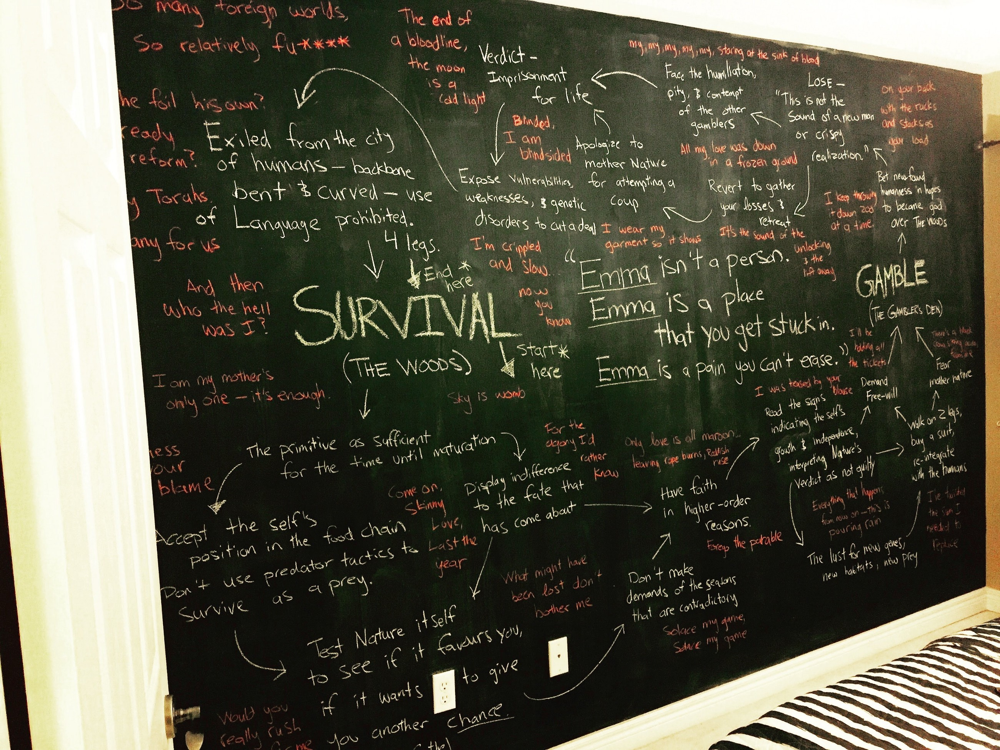

Bon Iver’s album For Emma, Forever Ago has always stood out as a piece of bare, raw, but painstakingly crafted expression of emotion. I’ve often put off truly interpreting it deeply — firstly because of its vague wistful one liners, second because part of its magic is misinterpretation, mondegreens, and defiance of order. Nevertheless, tonight, something hit and, remembering the powerful quote of Justin describing Emma, I was able to patch together a narrative that could help me explore it’s creaky, wooden structure and see between its cracks. Of course the narrative itself is entirely metaphorical and quite probably not necessarily intended by Bon Iver — but it’s a framework that, for me, captures the big, literary, picture of the album.
> # “Emma isn’t a person. Emma is a place that you get stuck in. Emma is a pain you can’t erase.” — Justin Vernon

I saw Emma — the place you get stuck in — as a cycle of rebirth and decay — a sort of endless oscillation between field and city, between animal and human, between **Survival and Gamble**. Reading the history of the album, one could call it, as a quick description, a break up album but that simplifies its dynamics and back-and-forth between order and chaos. Emma reminds me of Walt Whitman embracing his contradictions by claiming the infamous claim, *‘I contain multitudes’*. It’s not about endings or new beginnings, it’s about getting stuck in a cyclical current that yearns for either but achieves neither. Though the cycle can certainly engulf you post-heartbreak, I think there are many, many more entrances (most having something to do with humiliation, betrayal, and loss of innocence).

The cycle is spread across all the songs in a non-chronological, disorderly mess, but *Flume* and *Skinny Love* model the Survival end well, while *Re:Stacks* and *Blindsided* highlight the impossible and helpless gamble.

### Survival

Survival is a humbling and degrading acceptance of one’s position on the social food chain — it calls for animalistic, instinctive behaviour that both rages against the cruelness of systems but puts one’s self in the hands of a destiny of sorts.
> # “I am my mother’s only one — it’s enough.”

At this point, Justin describes a lost but understanding man who doesn’t know why he still believes and hopes but knows he does. Love, guilt, and even oppression are given rights to attack the self, and the self simply endures, leaving its fate in the hands of natural selection (survival of the fittest). He provokes destiny for a verdict, leaving it to judge him. Eventually the self achieves realization and starts to ponder the causes behind its sorry state — taking this pondering as a sign that it has been allowed to return to the land of men and demand rights over the elements that once betrayed it. But the same destiny that has brought about the rebirth is looked at with fear, since it has the equal ability to bring about the decay. This “creature fear” and paranoia pushes the self to look for ways to overcome its animalistic dependencies and blinded, it Gambles to become a god.
> # “Everything that happens from now on — this is pouring rain. This is paralyzed.”

### Gamble

The Gamble is a pitiful gamble because it’s one that only those miserable folks who have nothing to lose are willing to take. Yet, the self, terrified at having witnessed a decaying season, goes all in, hoping such a bravery will be rewarded with a control to overcome its own humanness. Of course, these are impossible odds. The utter loss awakens the man but not without humiliating him in front of the rest of creation. As a last effort, he confesses his agenda to everyone and anyone that will hear it in hopes that the confession will invoke enough pity to lighten his sentence.
> # “I’m crippled and slow”, “I wear my garment so it shows, now you know.”

He is exiled from the systems of human society, he reeks of vulnerability, of loneliness. This is, of course, unacceptable to a modern city. He is forced to retreat to the wilderness, to display cowardice, and to lose the ability for communication. He goes on four legs — back within the mode of Survival though on good terms with destiny… the cycle resets.
> # “So did he foil his own? Is he ready to reform? So many Torahs, so many for us.”
