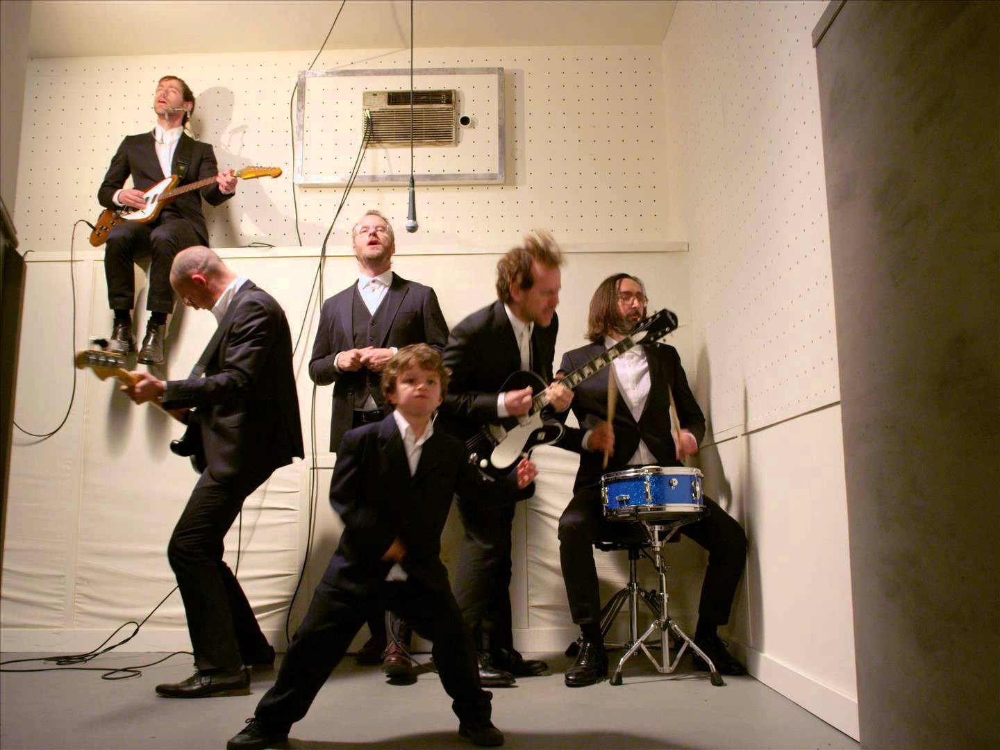

An on-going list of interpretative definitions of *The National [band]* symbols

### Ghost

The thought of a being that occupies you day and night without its actual physical presence. Being could be an actual person, based on an actual person, or a far removed imagination of an actual person not applicable to reality.

### Evil

What eats away at your brain and corrupts your logic circuits.

### Delicate Man

When pricey stuff makes you dizzy.

### Love

Quiet company — something that can always be done better — what keeps you awake at night — terrible —that which should never be disclosed to strangers — a means to maintain illusory power over another — the miracle of the ordinary man.

### Arms

Glue to hold together friends, family, and lovers (that eventually is not enough.)

### Sorrow

A substance that can contaminate one’s milk and honey and build cities. Comes in various forms including as a girl inside a cake. The substance is known to wait in the users bloodstream and eventually win over control of muscular, neural, and hormonal activity.

### Green gloves

A tool to adopt the personality and memory of another in order to stay close to them despite having disconnected.

### Exit

A path leading back into the world of freedom from the occupation of *ghosts.*

### 29 years

As far back as one can remember.

### Ending

A little death before the big, Real one.

### Wife

The one who fixes what friends cannot.

### Stranger

A state of being unrecognizable by those you recognize.

### Light

What the clumsy head keeps bumping into.

### Sea

A mixture consisting of ghostly loves, friends, desires, and pains, diluted with high amounts of water and salt to hide them from insincere listeners.

### Today

The day that blatantly flaunts — more so than others — its ability to steal anything and everything from you.

### “Why?”

What one holds back from asking loved ones in private so as not to diminish the public reputation of their love.

### A Need

An object or experience one is sure will lower the attractiveness of death.

### A Want

A gamble for meaning, usually with 50–50 odds but not necessarily. Found more often among those with the privilege to make bad choices.

### Pink Rabbit

The drink of choice during *ghost *summoning rituals or ceremonies. It is said to increase the chances of success if one has the alias or image of the *ghost *in mind while sipping this drink, although this has yet to be scientifically proven.

### High

An elated state of excessive positivity that denies, undermines, or overlooks the existence of negative emotions within the loved ones around you.

### Genius

What it takes to live a life without second guessing yourself. A quality found only among others and therefore its existence is yet to be proven.

### Children

Those who know, within seconds, the underlying reality of their experiences.

### Humiliation

The Way. The Tao. “That in virtue of which all things happen or exist.” The latent quality one would eventually discover behind all human experiences, including the act of existence.

### Tunnel Vision

A necessary ability required to navigate and commit to a single decision among the anxiety-ridden realm of infinite and open possibility.

### Far

To simultaneously fulfill the requirements of both presence and non-presence. Once rumoured to be impossible but recently proven true through case studies of modern living and theoretical quantum physics.

### Wine

The methods, substances, and processes that are involved in the manual and willful induction into a state of *Humiliation *— popularized in the post-modern era by the secular saints and mystics in response to hyper-professional corporate life styles.

### Weed

The methods, substances, and processes that are involved in the manual and willful removal of one’s self from the primordial state of Humiliation — popularized in the post-modern era by permissive hedonists and self-care professionals.

### Beg

To go behind another’s back and ask for their love from God directly.

### New York

The Mecca of re-creation — where man can pretend long enough to become something else.

### A Goodbye

The act that reminds one of the presence of others.

### Childhood

Where all our authentic loves come from.

### Adults

Chief creators of artificial, CGI loves.

### Val Jestor

The uncle that tempts us, against our better judgement, towards our nature.

### Blame

A method to grant someone significant importance in one’s own life – easy to execute but takes practice to be its subject.

### **Guilty Party**

A spontaneous event in which participants take turns practicing the execution and subjugation of Blame. The research is still silent on how the event come about but cautions individuals to avoid attendance by any means necessary – though it is unclear if participants have any control or if it is a matter of Providence.

### **Liquor Store**

The formal excuse one needs for meetings as one secretly falls in love.

### **Dark Side of the Gym**

A registered zone where the subject allows ‘just about anything’ to befall him/her. A slow dance is required to reach the location and any brute force will lock you out from its effect almost immediately.

### **A Way**

A lost item of childhood holding great sentiment value. Its loss conscripts the subject into a lifetime war to recover it and bring it safely to adulthood. Most fail if they are unable to ask a partner for help.

[View Post on Medium][MediumPost]

[MediumPost]: https://medium.com/@shahamfarooq/the-nationals-lyrical-dictionary-2ae1f2cfd25c "The National’s Lyrical-Dictionary"
