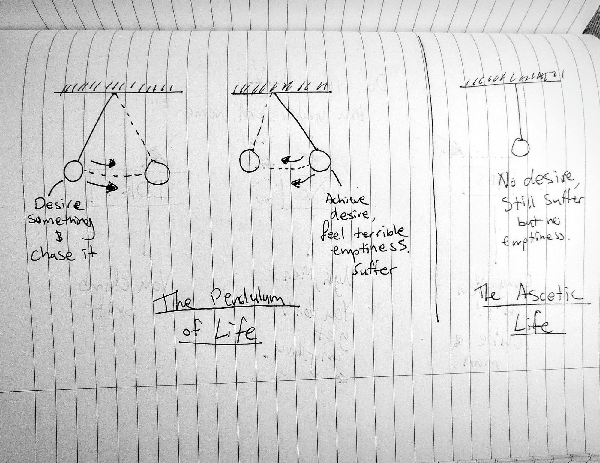

As Ramadan enters our lives, disturbing that rote of a procedure that we call ‘living’, it demands fresh sacrifices. Though the ‘not eating’ part opens up pockets of time here and there, the culture of Ramadan and its ‘extra-curricular’ — but highly encouraged — activities take up almost the entire evening and then some. Night prayers (Taraweeh), even if performed minimally (8 ‘rakats’), take you close to or past your normal ‘bed time’ (if you’re a working person). Since the hours of sunlight are usually consumed by work/school/etc. anyways, that practically leaves you with about 3–4 weekends to take on bigger tasks — if you can deny yourself rest as well as the blessed opportunity to do more religious rituals. Needless to say, Ramadan is demanding, but this is not discouraging or overly strenuous on Muslims who are socially and culturally well-accustomed to such a sacrifice on an annual basis. Fast forward a month later and we celebrate all these sacrifices on Eid, enjoying the company of friends and family and food during daylight hours. Fast forward a little bit more and the plot twists: some of us are hit with an existential anxiety, a withdrawal of sorts, a nagging, gnawing feeling of Freedom and all the wonderful Anxiety that comes with it.

I use ‘Freedom’ here, not to mean any ‘liberating’ element (as we will see why that is certainly not the case), but merely to describe the unallocated chunks of time in our schedule post-Ramadan. ‘Anxiety’, however, I use with all its full-fledged, Sartrean, existential implications — as Kierkegaard’s dread and dizziness, as anguish, as the general apprehension one feels at the paradoxical consequence of freedom. Personally, I prefer the term ‘nausea’ after Sartre’s novel which reflects this issue with vivid imagery: an upsetting, clumsy, inexplicable feeling (that comes and goes) from internalizing the fact that the moments of our life do not ‘order’ themselves in some neat ‘meant-to-be’ way. How does this have relation to Ramadan? Simply put: **Having occupied half our time in the duties of Ramadan, we come to terms with an anxiety-ridden, nauseating truth: half of our regular living is so useless (lacking Meaning) that we could give it up without experiencing a fundamental loss of any kind.** Let me explain.

*Figure 1.0: Summary of Stages (discussed below)*

## The Insatiable Will

It is uncanny how well Schopenhauer’s description of the human Will works to describe the constrained process of Ramadan. To enumerate the human drive (Will) — referencing Plato’s ‘*continual Becoming and never Being’* definition of a human — Schopenhauer claims,
> “…this manifold restless motion is produced and kept up by the agency of two simple impulses — **hunger** and **the sexual instinct**; aided a little, perhaps, by the **influence of boredom**, but by nothing else…”

The procedures of Ramadan constrain us, interestingly, on just those — restricting our eating despite our hunger, restricting sexual acts despite the instinct, and perhaps, restricting entertainment despite the influence of our boredom. As these impulses are being fulfilled on a regular schedule, they can, for all practical purposes, go completely under the radar as ‘driving’ elements of the Will. Ramadan performs the reversal: leaving these unsatisfied, we perform a phenomenological exercise akin to Sartre’s temporal operation of ‘negation’ as regards to Pierre in the cafe:
> Sartre (BN, 9–10) discusses the example of entering a café to meet Pierre and discovering his absence from his usual place. Sartre talks of this absence as ‘haunting’ the café. Importantly, this is not just a psychological state, because a ‘nothingness’ is really experienced. The nothingness in question is also not simply the result of applying a logical operator, negation, to a proposition. For it is not the same to say that there is no rhinoceros in the café, and to say that Pierre is not there. The first is a purely logical construction that reveals nothing about the world, while the second does. Sartre says it points to an objective fact. However, this objective fact is not simply given independently of human beings. Rather, it is produced by consciousness.

To avoid getting too philosophical and missing the point, the point is, simply: the insatiability of the ‘Will’ is made apparent and obviously present only by… not satisfying it. And therefore, in Ramadan, what we get is a big, fat, giant blob of ‘***consciousness’ — ***an awareness of the Self and the cause of all of our existential troubles in the near future. Taken away from our routines, we may find ourselves, very consciously, recalling our separation from them with some bitter-sweet sadness and envisioning our reunion with great romanticism. (“*Ah, after Eid, I’ll get to watch the new season of Brooklyn 99, and listen to the new album by CHVRCHES, and I’ll visit that new restaurant that serves the same food I eat everyday except with some weird, new-age, millennial aesthetics…*”, etc. etc.). Yet, as Eid celebrations fade, the romanticism of this ‘Freedom’ fails us. We’d like to deny it but it’s there, the truth, the pestering internal monologue we attempt to suppress before it unionizes into a revolution, that unsettling feeling of Emptiness: all this I waited for, all this that was supposed to provide me with pleasure and meaning, its all so…. not-enough, so bland, so utterly worthless to my *Continually Becoming*. To attempt a software analogy: it’s as if we’ve accidentally restarted our operating system (OS) and come to the realization that all these processes that we’ve been afraid to lose, we can do without just fine (we may actually operate faster without the clutter?).

Though we can find examples to deny Schopenhauer’s pessimistic view — that we are stuck in a cycle of seeking to fill our drives, filling them, and then experiencing an Emptiness — they hold up well in the face of our re-opened schedule post-Ramadan. To summarize: we’ve Sacrificed our routines in Ramadan, and then retrieved back those chunks of time post-Ramadan, attempted (or merely thought about) filling them with our initial routines, but instead have come face to face with an Emptiness we’d desperately like to get rid of. Depending on how much ‘consciousness’ we’ve achieved in Ramadan, the span of this Emptiness will vary — maybe it’s a day before we find ways to suppress it and return to those same useless routines, maybe a week, maybe a bit more, but eventually, unconfronted, this Emptiness will go back deep inside us and the consciousness of how we spend our time and our base impulses will dwindle down to an occasional whisper that comes about when we get extra-tired from a day of hard-work. Yet, this is not the ending I’ve promised you, we are still one alchemical reaction away from Anxiety.

## The Alchemy of Anxiety: From Emptiness, via Consciousness

All this capitalized-first-letter terminology is getting loaded, and I, as a mere software engineer, would not dare to take on responsibility for the philosophy behind these terms, so let’s get back to simpler narratives. What do we make of our Emptiness, this not-enough-ness of what used to be half our daily living? Schopenhauer’s answer is close to the ascetic one: the Emptiness shows how all these things you’ve been attached to have actually always been ‘empty and hollow’, you are only realizing it now. Therefore, leave them, and anything like them. Stop attaching and exerting yourself for these meaningless things (of course, Schopenhauer’s meaningless things is basically most of life itself…), and though you may never be ‘happy’, you can at least stop experiencing that dreadful Emptiness after fulfilling your desires.

*Figure 2.0: Simplistic Schopenhauer — stop your time and it won’t bother you.*

In ‘religious’ terms, the above perspective, more or less, translates to: What you were doing in Ramadan was ‘real and true’, all this other ‘worldly’ stuff fogs your vision and disturbs your ‘spiritual’ soul. You must abandon all these ‘non-religious’ routines and rituals and try to carry as much of your Ramadan-life into your regular-life as possible. Though I don’t deny that we should attempt to carry good, wholesome habits (and attitudes) of Ramadan forward, this rhetoric of a spiritual-and-worldly(sacred-and-profane, real-and-fake) dichotomy we generally find around religion betrays the Islamic context. Primarily, because Islam does not necessarily entertain such a dichotomy in the first place — eating ‘halal’ food (acting on hunger), sexual activities within marriage (acting on sexual instinct), and actively finding appropriate occupations and activities (acting on an influence of boredom) are shown to be quite ‘spiritual’ in nature (and eternally rewarding!) on various occasions in the Prophetic tradition… So deviating from such tired old rhetoric, I think the context of Ramadan offers a different conclusion: an Anxiety. **[1]**

Though the consciousness of our human drives leads us to the Emptiness above, it also acts as the exit route out. In this sense, consciousness acts as a guide, leading us to a temporary shelter where we fester and fiddle with newly gained insights of the Self rather safely, and then out, into the dangerous contingent reality where we must actively decide on how to use our newly gained Freedom without past prejudices. Post-Ramadan is, like many rituals that make us conscious of ourselves, an invitation to redesign a reality we forgot had been previously designed by our very own choices. Nothing simply ‘came to be’ about who we are today, it was not so ‘neatly ordered’ as we’d like to think — a dynamically changing set of decisions ranging from simple choices of what to eat to grander commitments for the people and places around us designed the very essence we will be held accountable for. Post-Ramadan is the recognition of our (Kierkegaardian) angst that lurks within us, the contingent blob like nature of our Self, and a kind of ‘meaningless’ of that very nature as it is discovered to lack any ‘meant-to-be-like-so’ element — it is to come to terms with our Will so we may re-appreciate its very Freedom, despite its base impulses. We must now meticulously choose the activities and attachments that will occupy our schedules. Learning from our very-conscious self reflection in Ramadan, if we are to do a good job of re-scheduling, we hope to evaluate our living as more worthwhile the next time around. Choosing this option — i.e. denying all the temptations to sedate and drug the Emptiness away with the same trivial tasks of our past — we will be faced with an inevitable Anxiety, acting as a sign from the Heavens that we are, in fact, on the right track.

**The Islamic conclusion, as such, is not to empty ourselves in the face of Emptiness, it is to re-commit to a re-designing process.** The Zen teachings stress the importance to empty the pitcher before refilling it, and yet we must equally stress the importance of filling it before we empty it (once again, next Ramadan). More so, Post-Ramadan is, to appropriate the Leninist slogan, a chance to ‘*begin from the beginning’* — and to deal with all the Sartrean Anxiety that comes with such an endeavour.

*Figure 3.0: Leninist Model of Progress*

## [1]

A companion of the Prophet was surprised to hear that sexual relations within marriage would be counted as a 'good deed’ considering the carnal-ness of such an act. The prophet responded to this surprise by reminding him, 'If you had gone about fulfilling your desire in a forbidden manner, would you not be sinned? [And therefore, it is only fair that your commitment to the right path should be rewarded]”. So we see the prophetic spirituality more fluid than the mystic’s and the ascetic’s spirituality — it accommodates for the natural human drive without giving it free reign over the human.
