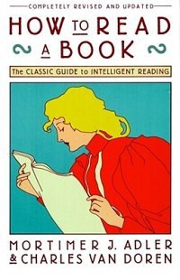

Some years ago, when I decided I wanted to be actively reading — in classic DIY fashion — I picked up [How to Read a Book: The Classic Guide to Intelligent Reading](https://www.goodreads.com/book/show/567610.How_to_Read_a_Book).

And of course, as an engineer, when you come across a book that reads in such a linear fashion, it is incumbent upon you to summarize it in a flow chart — it’s honestly a little surprising I couldn’t find any summary visualization of this book with a quick search. Regardless, I love information driven visuals, it’s how I learn so I made my own — it’s not the best and could do with a few edits after all these years, but thought I’d share it for anyone else looking. Do share if you know of a similar (and presumably better) resource.

[View Post on Medium][MediumPost]

[MediumPost]: https://medium.com/@shahamfarooq/adlers-how-to-read-a-book-flow-chart-cb4547c26be1 "Adler’s 'How to Read a Book' Flow Chart"