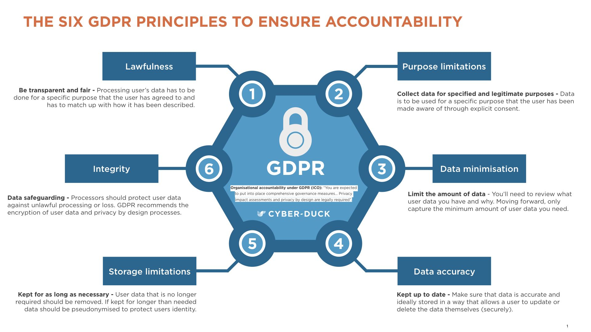

Researching GDPR and its impact, I came across some elements of GDPR that piqued my interest for what they implied about our culture and paradigms around data privacy:

**A. What is ‘free’ consent? 
B. Data as an ‘object’ vs. data as an ‘experience of you’ 
C. To be forgotten by the network beyond the individual**

## Introduction

GDPR is the EU’s **General Data Protection Regulation** that came into effect recently (May 25, 2018), radically shifting the transaction of **personal data** between **data controllers** or **data processors** and **data subjects**. GDPR defines specific roles so let’s make sure we understand the terms:

* **Natural Person:** “[A]n identifiable natural person is one who can be identified, directly or indirectly, in particular by reference to an identifier such as a name, an identification number, location data, an online identifier or to one or more factors specific to the physical, physiological, genetic, mental, economic, cultural or social identity of that natural person.” — the **Data Subject**

* **“Personal”** **Data**: any information relating to a *natural person*

* **Data Controller:** Entity determining purpose and means by which *personal data* is processed

* **Data Joint-Controller:** Entity determining purpose and means by which *personal data* is processed together with one or more entities

* **Data Processor:** Processes *personal data* on behalf of the *data controller*

There are multiple resources to understand the scope of GDPR, I’ve found the following summaries are great to understand the main points:

* [Must Know Simple Guide to GDPR](https://orionglobalms.com/6-key-facts-gdpr-simple-guide/)

* [GDPR Key Changes ](https://eugdpr.org/the-regulation/)

* [Highlights of GDPR for Canadian Orgs](https://blg.com/en/News-And-Publications/Publication_5105?sd=2018)

* [GDPR in a Nutshell](http://datatovalue.co.uk/the-gdpr-in-a-nutshell/)

## Points of Philosophical Interest

### A — “Consent is not freely given if a person is unable to freely refuse consent without detriment.”

GDPR is perhaps strictest as how it defines ‘consent’ — in fact, some feel that under GDPR, companies will probably look to collect personal data on grounds other than consent because of how difficult it is to validate ‘consent’ under GDPR criteria. I find the statement **(A)** to be profound as it goes past the surface exterior of ‘free choice’. Imbued within it are perhaps learnings from post-modern analysis of power imbalance — but one thing is certain: **if a citizen is given a choice in which a refusal contains a loss for him/her, no matter how ‘technically’ free the choice was, GDPR is not having it, that’s not a ‘free’ enough request for consent.** The idea of a ‘free choice’ then, has been recognized more deeply than in earlier definitions of consent.

### B — Purpose Limitation, a phenomenological limitation?

Purpose Limitation is a principle of GDPR that basically says data must ***only*** be processed for the purpose that it was collected. So, if a company requested a picture of your face for facial recognition technology (ex. on your iPhone), they can’t use it to train models to understand your age. What’s the philosophy here? I think this hints at a certain mismatch between what data really ‘means’ to data controllers versus how data subjects (we) see it.

We’ve often seen data as an ‘object’ that you allow another entity to ‘borrow’ or even claim ‘ownership’ over and then we question the ‘morality’ of data controller (i.e. a company) if the ‘object’ has been used appropriately or not. But with **Purpose Limitation** in GDPR, you don’t consent over your data ‘as an object’ — rather, you are consenting to only a specific way a company is allowed to ‘experience’ you through your data. This is maybe a rough connection, but GDPR has a more phenomenological view of data and **Purpose Limitation** acts as a contractual constraint on that very phenomenological approach.

As a simple description, in a phenomenological exercise, you often begin with a set of *experiences* from a subject that are examined and re-examined for their biases and suppositions to almost ‘see the world through the subject’s eyes’. This is not so far from what automated algorithms attempt to do from your data — algorithms attempt to model you, so the data controller can see as you see and make decisions based on that knowledge. **Purpose Limitation** limits the scope of the company’s phenomenological exercise, and so your contractual consent only allows for a specific interpretation of you within a specified dimension. This helps data subjects (us) to better value our data and preform a reversal of the phenomenological exercise from the company — under the GDPR worldview, we can see our own data as the data controller sees it.
> **Side Note:** a basic understanding of privacy in the digital age is that the true infringement to your identity and privacy is not exposure of the exact information you provide but the inferences made on that information for secondary-purposes — ex. a “security” camera taking video footage for real time advertisement targeting as you walk into a store. Furthermore, cross referencing between identifiers (driver’s licence, student ID, passport, etc.) can help build an extremely detailed profile (beyond anything a single piece of identification can provide). With **Purpose Limitation**, we can force the scope of data controllers to only look at the identifier(s) specifically appropriate for their use case and nothing more.

### C — The Right to be Forgotten.. by you and by everyone you talked to about me!

Another substantial change with GDPR, even from the Canadian regulation of PIPEDA, comes in the form of a far reaching directive that allows for a citizen to request to be ‘forgotten’ more ‘completely’ than before. This means that upon a user’s request, an organization is required to erase the user’s data (as long as there is no legitimate reason to keep it) as well as **inform and request all third party organizations that may have copies or links to the user’s data (e.g. through contracts) to delete it as well.** The implication is that if an entity became knowledgeable about a user through the organization, it is the organizations responsibility to take appropriate measures to make the entity ‘forget’ that user as well.

This property of the regulation takes into account the complexity of the global (data) market as well as understand that the responsibility of the proliferation of information should be upon proliferators. This is also a measure of accountability and discourages the usage of third-party ‘scapegoats’. Blame, under GDPR is not only action-oriented, the philosophy of GDPR sees connected systems rather than good/bad individuals and therefore sees facilitation within structural networks also as blameworthy for any individual ‘bad’ action. Though not exactly, there are rough outlines of a more sociological-based view when dealing with data controller and their networks.

## Concluding Remarks

Maybe you found the points above as interesting as I did, maybe it wasn’t that big of a deal for you — regardless, you should know that as events have unfolded so far, GDPR seems to be a big deal (so you’re **wrong** if you think otherwise)!

Sources for this post and other resources to read if you’d like to know more:

* [Good comparison between Canadian PIPEDA vs. GDPR](https://iapp.org/news/a/matchup-canadas-pipeda-and-the-gdpr/)

* [Industry Research on public perception of privacy after Cambridge Analytica Scandal](https://www.janrain.com/resources/industry-research/consumer-attitudes-toward-data-privacy-survey-2018)

* [The first complaints against Facebook and Google under GDPR](https://www.theguardian.com/technology/2018/may/25/facebook-google-gdpr-complaints-eu-consumer-rights)

> Another interesting analysis I found while researching GDPR impact are speculations on the economic impact of GDPR. [This paper theorizes that under GDPR, data itself will become a ‘financial option’ of sorts with associated risk as it will not be guaranteed to provide ‘positive’ value for the specific operation it is collected for — and since it can’t be contractually used for anything else due to Purpose Limitation principle, it will basically be of zero/negative value to the company.](https://www.academia.edu/37376314/Some_Economic_Consequences_of_the_GDPR) This ‘option-izing’ of data may then give rise to complex financial data markets including ‘data insurance’ companies that mitigate the risk for a company if the data serves no operation value.

[View Post on Medium][MediumPost]

[MediumPost]: https://medium.com/@shahamfarooq/philosophy-of-gdpr-264ece34450 "Points of Philosophical Interest from GDPR"