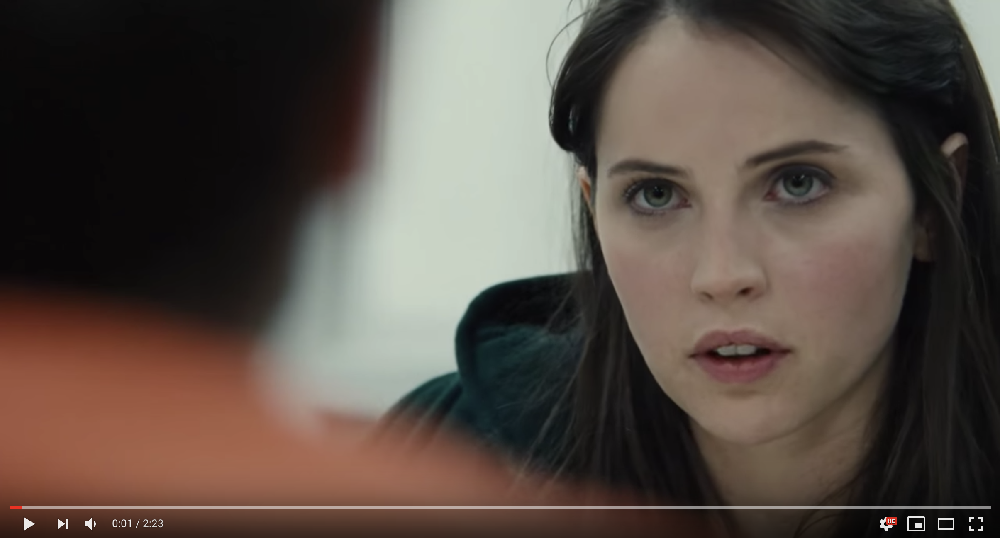

I know many curious folks (myself included) tend to enjoy exploring the narcissistic killers we make movies/series about (Ted Bundy, etc.). The danger of staring into the abyss is captivating, but at some point, you ask the question, 'Why do I want to *understand* these terrible, narcissistic killers?'.

 With regards to this question, I keep coming back to [a monologue by Felicity Jones' [Jill Barker] in True Story](https://www.youtube.com/watch?v=v7ymzbbbKA4) (which, ironically, is about a narcissistic killer..). 
 
 Jill, watching her boyfriend (a journalist, Michael Finkel played by Jonah Hill) being manipulated from afar by Christian Longo (played by James Franco), goes to visit the accused killer at the county jail. Longo has been convicted of murdering his wife and three children in 2001 and the movie shows an obviously guilty killer playing mind games with Finkel - appealing to Finkel's sense of curiosity and desire for a 'good story'. 
 
 **Here's the script:**
 
> **Jill Barker**: [In the prison visiting room, talking to Christian Longo] Can I play you something?

> *[Jill reaches for her iPhone, presses play and beautiful music is heard]*

> **Jill Barker**: [Se La Mia Morte Brami](https://www.youtube.com/watch?v=pMaYAFuC3RQ). If You Crave My Death. Carlo Gesualdo wrote it in 1611. A few years after killing his wife and newborn son. His wife had a lover so he tracked them down with a hunting knife. He stabbed her many, many times all over her body, and as she was bleeding to death on the floor, he forced the lover to strip her naked, put on her bloody nightdress and humiliate himself, before shooting him in the head. Then he went upstairs and beat his infant son to death against the side of his crib. The music is **almost beautiful enough to make me forget** I am listening to something written by a man who broke his baby's skull on a piece of furniture... but not quite.

> *[Jill stops the music]*

> **Jill Barker**: You see Mike wants to try and understand you. **I think he believes that if he can understand you then maybe he can understand himself, but I don't wanna understand you at all.** You're a murderer. You kill women and children. You're a narcissist who resents every single second of attention not given to you. I'm here to tell you that whatever else is coming to you, you will never ever escape what you are.

> *[Jill stands up and leaves the visiting room]*

Do we seek this kind of art out under the delusion that it will help us *understand ourselves*? I think of the logical conclusion of feeding our curiosity with such an approach - when the beauty eventually results in us suspending our moral considerations and truly 'forgetting' the evil behind the acts. Isn't a 'forgetting' of that kind an obscene and vulgar behaviour... even a little 'evil' from us?

Maybe a little Platonic caution here wouldn't be a bad idea. [Someone once asked if *'Poetry was dead'* on a web chat with the philosopher Slavoj Zizek](https://www.theguardian.com/books/live/2014/oct/06/slavoj-zizek-webchat-absolute-recoil?page=with:block-543538ece4b055589a2e7d69), to which he responded:

> "It's not dead, but it's heavily wounded and it's its own guilt and responsibility. The more I look at the genesis of modern cases of ethnic cleansing, the more I discover that there always is a poet who did the preparatory work: in Bosnia, Rwanda and so on. Stephen Weinberg said that you need something like religion to make good people do evil things. **I think poetry can also do this, with its strong ecstatic vision it can blind you from the horrors of what you are actually doing. So I think when Plato banned poets from the city, he had a point.**" 
 &nbsp;&nbsp; &mdash; Slavoj Zizek