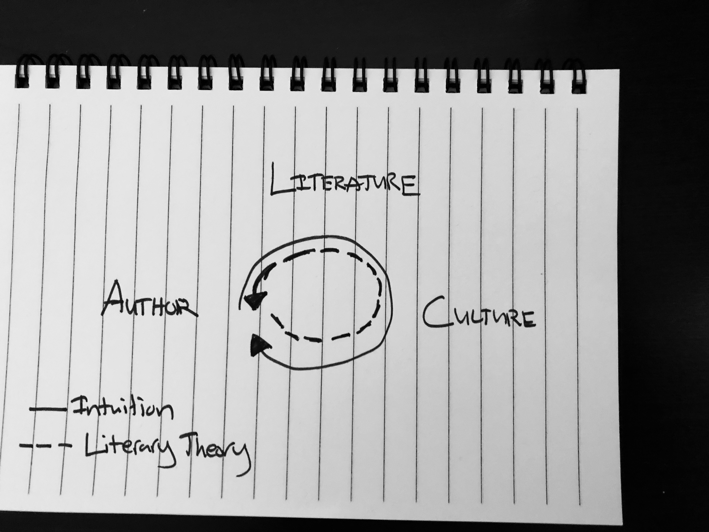

A [recent article, critiquing modern literary theory,](https://quillette.com/2019/02/15/high-theory-and-low-seriousness/) brought up some questions for readers of my kind - i.e. those who read primarily for pleasure. While academia may have a certain viewpoint of what literary theory should behave like, I wonder if that same criteria bleeds over to the amateur reader? I'll quote parts of the article below and question the assumptions.

#### Definition of Literary Theory:

>"...literary theory in recent years has sought to explain the degree to which the text is more the product of a culture than an individual author and in turn how those texts help to create the culture...
  
> ...Literary theory refers to any principles derived from internal analysis of literary texts or from knowledge external to the text that can be applied in multiple interpretive situations. All critical practice regarding literature depends on an underlying structure of ideas in at least two ways: theory provides a rationale for what constitutes the subject matter of criticism—"the literary"—and the specific aims of critical practice—the act of interpretation itself."
 &nbsp;&nbsp; &mdash; [IEP](https://www.iep.utm.edu/literary/#H1)

## Paying (too close) attention ruins the fun of reading?

> **Article:** Paying too close attention to hidden meanings and obscure symbols takes all the fun from reading... The serious reader spends an inordinate amount of energy trying to find profound representations in the most trivial of details. “A travel folder signifies Death. Coal holes represent the Underworld. Soda crackers are the Host. Three bottles of beer are—it’s obvious.”

What I find strange about this is that if I think back to my childhood, 'paying close attention to find secrets' was *the* definition of fun! As adults, we just have access to more theories which we apply to have the same fun - to find secrets, to find things others haven't noticed, to apply a narrative to a piece and take it all the way to see if it holds with the facts of the story. Cross-referencing *is* fun, seeing how a travel folder could signify Death and see to it that it is consistent with the rest of the plot *is* fun.

#### Importance of deep attention:

> “Here’s the only thing you need to remember from this talk: ‘Study something you love to death’—I mean ‘depth’! [laughter] ‘Study something you love in depth.’ I just gave you an hour, so tonight give me 45 minutes. Spend 45 minutes tonight studying something you love. Watch the first five minutes of your favorite movie 7 times. You will notice new things.” 
 &nbsp;&nbsp; &mdash; [Paul Karasik](https://austinkleon.com/2017/02/03/study-something-you-love-in-depth/)

> Instructions for ~~living a life~~ *(Literary theory?)*: 
Pay attention. 
Be astonished. 
Tell about it.
 &nbsp;&nbsp; &mdash; [Mary Oliver](https://poetrying.wordpress.com/2012/09/14/sometimes-mary-oliver/)

## *Dull* and Contradictory Interpretations?

> **Article:** deep reading is such an imprecise game that numerous dull and contradictory interpretations arise from the same passage. “Are you a Marxist? Then Herman Melville’s Pequod in Moby Dick can be a factory, Ahab the manager, the crew the working class. Is your point of view religious? The Pequod sailed on Christmas morning, a floating cathedral headed south. Do you follow Freud or Jung? Then your interpretations may be rich and multitudinous.”

*Contradictory* interpretations? Sure, but *dull* is a biased term here.. only because the writer does not find Marx, Freud, Jung, or Religious interesting? For anyone who appreciates them, why would *dull* apply? It seems the complaint here is more so ['why wasn't I consulted?' (WWIC)](https://www.ftrain.com/wwic). And then, what exactly is *imprecise* in fictional interpretation? Is *precision* to get to the author's intention - but is that really the point of literary theory? What if the [Author is Dead?](http://www.tbook.constantvzw.org/wp-content/death_authorbarthes.pdf)

I can't seem to understand why this point detracts from the pleasure of reading. If we treat literature as an aggregated image from a greater culture, literary theory can be seen as an attempt to transform literature back into the greater cultural coordinates. And we have a great analogy of multiple viewpoints (all 'true') in the example of [Datasauras: Same stats, different graphs](https://www.autodeskresearch.com/publications/samestats):

## Understanding takes away from Enjoyment?

> **Article:** ...the average academic critic tried to understand literature and thus ruined the enjoyment of it... 
Imagine the dejection a student about to begin university, eager to read the best that has ever been written, feels when they are told to examine some heavy tome of unreadable theory. It drains all the fun from reading.

This is the most patronizing of claims disguised as romanticism. Yes, understanding requires discipline, requires study, theory, and formulations. Why is this understandable in science and philosophy - where students accept it takes some tedious work to achieve an understanding that leads to greater pleasure - but in literary theory, it's suddenly 'ruining enjoyment'? I understand if literary theory is not everyone's cup of tea, just like scientific theory or philosophy isn't something everyone enjoys - but for those who enjoy it, why is it considered a disservice to the field of literature? 

Understanding *only adds* - I resort to a brilliant paragraph in [Feynman's 'pleasure of finding things out'](https://www.worldcat.org/wcpa/servlet/DCARead?standardNo=0738201081&standardNoType=1&excerpt=true):

> "I have a friend who's an artist and he's sometimes taken a view which I don't agree with very well. He'll hold up a flower and say, "Look how beautiful it is," and I'll agree, I think. And he says—"you see, I as an artist can see how beautiful this is, but you as a scientist, oh, take this all apart and it becomes a dull thing." And I think that he's kind of nutty. **First of all, the beauty that he sees is available to other people and to me, too, I believe, although I might not be quite as refined aesthetically as he is; but I can appreciate the beauty of a flower. At the same time I see much more about the flower than he sees**. I can imagine the cells in there, the complicated actions inside which also have a beauty. I mean it's not just beauty at this dimension of one centimeter, there is also beauty at a smaller dimension, the inner structure. Also the processes, the fact that the colors in the flower evolved in order to attract insects to pollinate it is interesting—it means that insects can see the color. It adds a question: Does this aesthetic sense also exist in the lower forms? Why is it aesthetic? All kinds of interesting questions which shows that a science knowledge only adds to the excitement and mystery and the awe of a flower. **It only adds; I don't understand how it subtracts.**"
 &nbsp;&nbsp; &mdash; Richard Feynman

## Theory should further literature?

> **Article:** I can remember attending a seminar on Virginia Woolf’s Orlando where the tutor seemed to view the book as an excuse to discuss Judith Butler’s theory of “gender performativity.” Something has surely gone wrong when literature is used to further theories rather than the other way around.

Really? Why? Who imposes that literature should be an end? For us readers-for-pleasure - pleasure is the end. And if literature functions as a means to enjoy or further the understanding of a theory, why should we feel guilty about this? In fact, under Tolstoy and David Foster Wallace's definition of 'art as empathy', literature sort of has a duty to step outside itself and engage with theories of reality.

## Literary Theory Doesn't have Predictive Value

> **Article:** The problem with literary theory is that it is not proper “theory.” At best, it is hypothesis without predictive value. There may be some descriptive capacity in literary “theories,” but they do not predict anything about prose or poetry.

Why does theory *have* to be predictive? In sociology, there is often a conflation between explanatory and predictive modeling. The debate goes on in sociology as well: what are the aims, is it to predict social behavior or to explain it? Turns out - big surprise - predicting the future is hard! Many social science theories explain, and there is value in that. Some even argue ["theoretical explanation of social phenomena is the only or ultimate aim of the social sciences"](http://www.jreiss.org/papers/Mechanisms_20-5.pdf). The attempt to discredit literary theory as 'improper' is not only bogus from a theory-definition point of view but, once again, misses that point that explanations on their own are *fun*. Why else do crowd-sourced interpretive websites like [Genius](https://genius.com/) enjoy a following?

## Literary Theory can't be refuted?

> **Article:** ..scientific and philosophical theories are open to refutation. Science is tethered to reality and scientific conjectures can thus be refuted by empirical evidence. Literature—being fictional—cannot. This allows literary theorists to gain adherents whilst being free from worries of rebuttal. The consequence is an ever swelling canon of contradictory deepities.

Scientific theories explain the real universe and are thus refuted by inconsistency found in reality (i.e. contradicting empirical evidence). Literary theory explain the fictional universe and are thus refuted by inconsistency found in the narrative (i.e. lack of coherence between theory and plot). The sly assumption in this critique is that literary theory is to find the 'Truth' like science, once again, what is the 'truth' in fiction? Similar to sociology, we compare explanatory theories by how compelling of a case they make to describe the subjects. If Marxist theory works well to define the plot of a novel, then literary theory interprets it through Marxism. For someone else, religious narratives work better. Different interpretations make more compelling cases for different people, so what? We feel in different ways - we see things in different ways. The rebuttals in literature differ than in science, why should they not? Again, there is a patronizing attitude here which hints that the field of literature has to adopt the methodologies of scientific/philosophical hypothesizing. [Katy Bohinc's answer to 'poetry embracing contradiction while philosophy does not'](http://www.openlettersmonthly.com/issue/interview-with-katy-bohinc-author-of-dear-alain/) is relevant here:

>"As for contradiction, yes! All I can say is yes! **Contradiction is even present in mathematics... contradiction and error are similarly necessary elements for the fabric of the universe as we know it. It’s deep in the fabric of translation, which naturally arises because we are, in fact, individuals.** But there’s a million contradictory things I could say about contradiction. Part of why I love being a poet – and not a philosopher – is that I don’t have to make sense. Badiou always has to “make sense,” in that his thoughts have to build into one complete system, largely. But *ugh*, to me that seems terrible, like being a statue! Because poetry doesn’t have the limitation of logic it can be interested in everything not logical, which is significant. It can turn on a dime and go onto the street or into outer space. In a sense, the limitation of poetry is that it can’t be too straightforward, or really, too proven. It takes “something else.” A jump, a leap, a romanticism, a star, a heart."
 &nbsp;&nbsp; &mdash; Katy Bohinc

Appropriating Bohinc's description for poetry, the rules under literary theory are different, maybe they're interpreting hearts and leaps, not just logic - this isn't a problem.

As for the '*swelling canon of contradictory deepities*', all I have to say is:

<!--  -->

## Tedious theorizing is mirthless?

> **Article:** [literary theory's] mirthless view of literature becomes a danger to the joy of reading. The idea that significant studies must be buttressed by significant sounding terminology is simply bunk. It is high time that theory be done in the manner Oscar Wilde said all serious things of life should be treated: “with sincere and studied triviality.”

While I think that yes, deep theorizing can be excessive and unpleasing, this is a matter of taste. There is no need to start a crusade against literary theory only because you might not enjoy some. What is mirthless (trash) to some is joy (treasure) to others. 

Finally, on the literary, tedious theorists who you may view as a bore, I'll refer to Chesterton's bit about how [the bore is stronger and more joyous than we are](https://books.google.ca/books?id=G19jDwAAQBAJ&pg=PT1595&lpg=PT1595&dq=the+bore+is+stronger+and+more+joyous+than+we+are+chesterton&source=bl&ots=QLrEGEdLEA&sig=ACfU3U0Ie6Osnpccy-tNGkyWRIYLxkr1OA&hl=en&sa=X&ved=2ahUKEwjI04TM6cjgAhUjuVkKHT2lDzcQ6AEwAXoECAgQAQ#v=onepage&q=the%20bore%20is%20stronger%20and%20more%20joyous%20than%20we%20are%20chesterton&f=false):

> Nothing is more keenly required than a defense of bores. When Byron divided humanity into the bores and bored, he omitted to notice that the higher qualities exist entirely in the bores, the lower qualities in the bored, among whom he counted himself. The bore, by his starry enthusiasm, his solemn happiness, may, in some sense, have proved himself poetical. The bored has certainly proved himself prosaic.
  
> We might, no doubt, find it a nuisance to count all the blades of grass or all the leaves of the trees; but this would not be because of our boldness or gaiety, but because of our lack of boldness and gaiety. The bore would go onward, bold and gay, and find the blades of grass as splendid as the swords of an army. **The bore is stronger and more joyous than we are**; he is a demigod--nay, he is a god. For it is the gods who do not tire of the iteration of things; to them the nightfall is always new, and the last rose as red as the first.
 &nbsp;&nbsp; &mdash; G.K. Chesterton

## Fun is in Making the Connections

I will end with a quote from 'the mummy doctor' Aufderheide who managed to be that bore to actually find medical and anthropological information in something as dead as mummies:

> "All knowledge is connected to all other knowledge. **The fun is in making the connections.**” 
 &nbsp;&nbsp; &mdash; [Arthur Aufderheide](https://www.newyorker.com/magazine/2005/05/16/the-mummy-doctor)