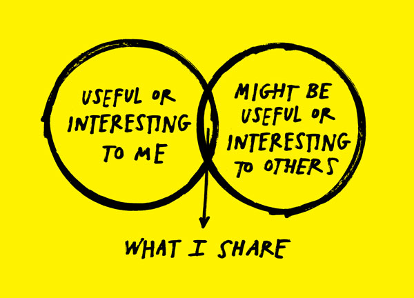

A [new bill is looking to find a replacement for Seattle's iconic Lenin Statue](http://mynorthwest.com/1286116/seattle-lenin-statue-replacement-bill/). Yes, I know, I had the same question: How in the hell did Lenin get to be in Seattle? I'll tell you, along with why I think the statue's journey gives us a caricature view of the social creative act.

## How it was Made

The story starts with **Bulgarian sculptor Emil Venkov** being *'commissioned'* (forced) to construct a statue of Lenin by the Communist Party of Czechoslovakia. Venkov, a man of will, stuck to the rules but made a creative (and political) decision to show Lenin as the *'bringer of revolution'* rather than a scholar - in this sense, rather than the usual *'gentle-scholar'* Lenin surrounded by books and children, we have an aggressive Lenin surrounded by abstract rifles and arms. Venkov wanted to depict the violence of Lenin. (Considering it passed approval, could they even tell this Lenin was different than the Lenin they were used to propagating? Almost as if it was so real, they did not notice the disturbance.)

T.S. Eliot's famous line can be playfully misappropriated here:

> “Immature poets imitate; mature poets steal; **bad poets deface what they take, and good poets make it into something better, or at least something different.**”
 &nbsp;&nbsp; &mdash; T.S. Eliot

Maybe most of us are not ordered by the Communist Party like Venkov, but nevertheless we are 'ordered' by a 'they'. Something out there -  society, culture, whatever you want to call it - orders you to use your muse to create for its profit (conceptually or monetarily). It threatens you with a status quo, challenges your held values, and entices you with survival. You can be brave and deface by rebelling - leading you to be shunned or alienated most likely - or you can be courageous, nod your head, turn around, and *make something different.*

Under threat of Gulag like Venkov or just good old social alienation, Austin Kleon's Venn diagram of sharing can be applied:

## How it became Art

The statue was installed in 1988 and shortly after, in 1989, we saw the fall of Czechoslovak communism. Destiny would have it that a one **Lewis Carpenter** - originally from Issaquah, Washington - would find it in a scrapyard of Poprad, Slovakia and decide to take it back with him to the States, paying a large amount. More official accounts say Carpenter wanted to preserve the Art despite the unpopularity of Lenin. But I like to think the more accurate [account comes from his former wife](https://www.king5.com/article/news/local/lenin-statue-silent-protest-against-communism-says-family-member/465856661), who says, reflecting back, *"If you ask Lew why he did it, he'd say, for cookies, which for him meant* ***for fun."***

Unfortunately, Carpenter died in a car accident in the States before he could do anything with the statue. The family thought of selling it to a foundry to be melted but the foundry's founder, Peter Bevis, decided to display it in 1995 on private property until a buyer could be found. It's been in Seattle ever since.

The anecdote can highlight a more social discourse of art akin to what comes from **Marcel Duchamp** in his ***'The Creative Act'***:

> "All in all, the creative act is not performed by the artist alone; the spectator brings the work in contact with the external world by deciphering and interpreting its inner qualification and thus adds his contribution to the creative act. This becomes even more obvious when posterity gives its final verdict and sometimes rehabilitates forgotten artists."
 &nbsp;&nbsp; &mdash; Marcel Duchamp

Carpenter is the spectator par excellence, bringing the work out of the literal trash and in contact with the world. But it goes further, Carpenter performs the spectator act very consciously - he interprets it. And we often think interpretation is this analytic discourse of academic writings but many times, it's performed in a matter of seconds - Carpenter decides, using his god given spectator rights, that the piece is 'fun', that it is worth showing, that maybe it could attract customers to an authentic Slovakian Restaurant he planned to open.

The Spectator show carries on up to the present where *"the Lenin statue is often decorated, appropriated, or vandalized with various intentions, both whimsical and serious"*. Like an ending to a good romantic comedy, the intentionality Venkov hid in his piece has been uncovered and further expanded and manipulated by the spectators.

The creative act - the Art with a capital A - needs both Venkov *and* Carpenter to be courageous. It takes courage [to have fun with something in the trash.](https://austinkleon.com/2014/02/12/guilty-pleasures/) 

## How it Became a Debate

Of course, implied in Duchamp's definition is the indifference of the creative act. In response to protests calling for the removal of Confederate monuments and memorials, the alt-right, in a very *'then-you-have-to-throw-away-one-of-your-things-too'* fashion, protested back that the Lenin statue should also be removed as we should not 'idolize figures who have committed violent atrocities and sought to divide us'. In response to a social condition, the definition of the statue radically shifts back into what the Communist Party truly wanted. As Duchamp said,

> "[the artist] will have to wait for the verdict of the spectator in order that his [artistic] declarations take a social value"
 &nbsp;&nbsp; &mdash; Marcel Duchamp

The artist can proclaim his truth from the rooftops but the verdict comes from the crowd on the streets - the spectators decide not only *if* there is a social value but *what* that social value is.

