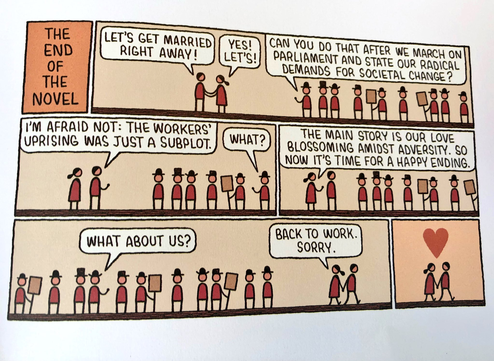

I recently found [an interesting song by Belle & Sebastian titled *'Marx & Engels'*](https://www.youtube.com/watch?v=-4FEOB_b2us). I'm fond of interdisciplinary connections and Duchamp's idea of conceptual art, so as expected, a Scottish indie-pop band referencing Marx just had me ecstatic.

Belle and Sebastian are a smart group, and one would assume well-read with the amount of times they reference books. There is definitely a literary-romantic-philosophy vibe around them akin to the feel one gets from people like Roland Barthes. Many of the ideas in their music reference a melodrama of love that surrounds the non-conformist, idealistic, and romantic youth. The protagonists of Belle and Sebastian are readers, inquisitive, and full of heartache since the novels they hold so dear to their hearts (with plots like the comic above) never come about in reality. But they are not recluses, nor ascetics - the desire to integrate in the culture, to belong and be part of the dynamics of relationships and society is ever present. The thematic heroes of Belle and Sebastian are amateurs, dilettantes in the loving sense of the label. Their characters are captured in the song, [*The Loneliness of the Middle Distance Runner*](https://genius.com/Belle-and-sebastian-the-loneliness-of-the-middle-distance-runner-lyrics):

> *So I spent the day in stories 
And in dreaming of the time when we're on stage 
Have you seen the loneliness of a middle distance runner 
When he stops the race and looks around?*

The middle distance runner, despite his mediocrity and the proliferation of normal distributions in nature, is left lonely. In my interpretation, it's not that there aren't other runners of the same caliber - there are a lot in fact - but none of them desire to participate in the cultural races of society. Society has two races: the long run, or the short run (the middle path, as usual, is not dramatic enough for attention) - but this has nothing to do with distance or time, long and short here are better described as high and low activities. Intellectual, conceptual activity is ordained as high-art for the high-functional folks while the 'trashy', billboard chasing, lowly-pleasure-appealing activity is for the conformist, who steers away from the application of any critical theory and absorbs in whatever comes at him. The middle distance runner commits to neither of these races - neither the academic, nor the lay. Commitment to either end eliminates some form of freedom the hero desires - both ends are conformists with their own set of rituals that demand obedience. **This is the fatal dilemma of the amateur: to be critical of the status quo, yet never fit in with the critics.**

Belle and Sebastian speak for that loneliness. The amateur, the dilettante, the aloof-careless-philosopher Montaigne, the chess-playing-artist Duchamp, the middle distance runner - they are all the same, they are all simultaneously fit for everything and unfit for anything. They are more than one but not enough for another.

## Marx & Engels 

Coming to the song *Marx & Engels* - the heartache deepens, the shy, non-conformist yet typical-idealist suffers another brutal recognition. Though the protagonist is accustomed to alienation from the status quo, he does not expect to feel so unwanted by the revolutionary... 

> *She spoke in dialect I could not understand 
But one thing that she made clear 
There was no coming on to her  
There was no intellect 
That she could respect 
If it couldn't see 
That the girl just wants to be 
Left alone with Marx and Engels for a while*

Though he and her bond over Communist literature, the event does not lead to the connection he envisions - despite wonderful conversations, she'd rather return to her books.

The intellectual-for-pleasure (our definition of the amateur) comes face to face with his farce. In truth, he is no revolutionary, he does not desire the tearing apart of the social fabric, he does not want to rearrange the targets of the status quo. The purpose of life, the definition of love, *desire* itself - he takes these as they are described in culture. He is merely interested in interesting viewpoints. There is no true, meaningful desire within him for radical change (though he is neither opposed to it) even if he is exhilarated at the thought of it. He is a wanderer, he likes stories and romantic ideals - most of which he adopts from unconventional, obscure sources. Here, he meets a girl that actually *is* the revolutionary he reads about. In ritual, they are both the same - they read the same literature, they are excited at the same theories, they enjoy the same music, etc. But they are separated by a significantly thick line: she commits, she believes - he only wanders, he only ruminates.

> Tom's sister from [500 Days of Summer](https://www.imdb.com/title/tt1022603/) imparting wisdom. (Tom is a decent example of the kind of idealist found in Belle and Sebastian's songs)

He does not understand someone who has truly abandoned the targets of the status quo. For him, non-conformity is a *subplot* and, therefore, not serious enough to prioritize its struggle above the human desire for love and connection. He suffers the loneliness: the authentic characters he loves (those with his disposition) have chosen to forego love for the disposition. Generally speaking, he loves those who *authentically* put struggle (non-conformity) above love (as defined by the occupying culture) and is, consequently, doomed to be *authentically* neglected.

Crudely put, *true* readers want to read and he wants *true* readers that would rather talk to him... he wants two mutually exclusive things at one time:

> “If neurotic is wanting two mutually exclusive things at one and the same time, then I'm neurotic as hell. I'll be flying back and forth between one mutually exclusive thing and another for the rest of my days.” - Sylvia Plath

The [comic below by Tom Gauld](https://www.amazon.ca/Baking-Kafka-Tom-Gauld/dp/1770462961) is a *perfect* illustration of our protagonist's ideals (that are inevitably betrayed because, as it turns out, some people really *mean* it when they say "I am a Marxist").

The song ends with female vocals:

> "The bourgeois, historically, has played a revolutionary part to end all feudal idyllic relationships. It has destroyed personal worth and, in place of freedom, is exploitation for profit alone. There is a spectre of the past in my bold assertion; we could learn much from the past."

It is a very appropriate passage to reference from *The Communist Manifesto*: like the bourgeois, the shy boy encourages the fall of the status quo... but only for his own self-interest (to find the kind of love he is looking for).

I'm sure there's probably a whole bunch to say about such a protagonist - anywhere from 'men are trash!' to 'I relate to him!' could be possible responses. Regardless, I just love the self-reflective ideas hiding about in Belle and Sebastian songs.

